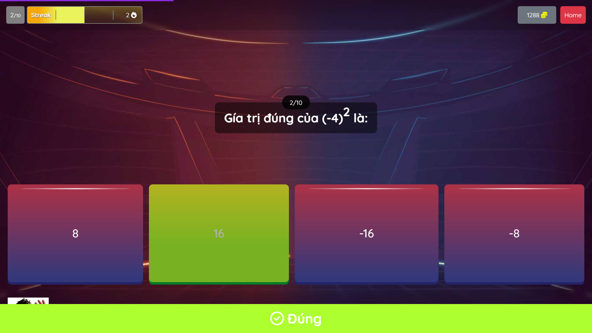
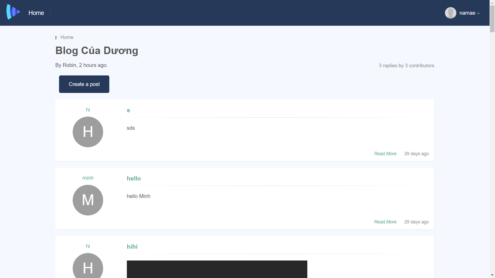

# F8-Javascript

# HỌC Javascript + DOM 

- Đây là repository chứa các bài tập và ghi chú của tôi trong quá trình học JavaScript, bao gồm các chủ đề:

- `Javascript` từ cơ bản đến năng cao: 
  - làm việc với các biến, hàm, đối tượng.
  - Các khái niệm liên quan đến Promise + async await 
  - Fetch API 

  
- `DOM`: Học cách thao tác và làm việc với DOM 
 
- `WebComopnent` Học cách tạo cấc thành phần HTML Element và tạo các Event custom bằng công nghệ của web thay vì dựa vào một Framework 

# Quá trình học

## 1. Học Javascript cơ bản

- Từ `lesson16 -> lesson25` 
- Học về Javascript cơ bản đến nâng câo
- Một số bài tập nổi bật
  - Bài 20: Làm việc với Array 
    - [Demo](https://buiduong2.github.io/F8-Javascript/lession20/) 
    - [Source Code](./lession20/)

  - Bài 21: làm việc với Array đa chiều 
    - [Demo](https://buiduong2.github.io/F8-Javascript/lession21/) 
    - [Source Code](./lession21/)

  - Bài 24: Làm việc với mảng lồng nhau và đệ quy category nhiều cập 
    - [Demo](https://buiduong2.github.io/F8-Javascript/lession24/) 
    - [Source Code](./lession24/)

## 2. Làm việc với DOM

- Từ `lesson-26 -> cho đến hết`
- Một số bài tập nổi bật
  - Bài 40:  Quizz Game hấp dẫn
    - [Demo](https://buiduong2.github.io/F8-Javascript/lession41/) 
    - [Source Code](./lession41/)

  - Bài 43: học tập xử lý Authentication + REGEX (API Backend được cung cấp bởi F8)
    - [Demo](https://buiduong2.github.io/F8-Javascript/lession43/) 
    - [Source Code](./lession43/)

  - Bài 26: Form Modal + tab + validation
    - [Demo](https://buiduong2.github.io/F8-Javascript/lession26/) 
    - [Source Code](./lession26/)

  - Bài 27: TODO LIst + drag TODO (JS thuần)
    - [Demo](https://buiduong2.github.io/F8-Javascript/lession27/) 
    - [Source Code](./lession27/)

  - Bài 31: Xây dựng chức năng Karaoke 
    - [Demo](https://buiduong2.github.io/F8-Javascript/lession31/) 
    - [Source Code](./lession31/)

## 3. Ngoài ra được giới thiệu 1 chút về Web Component + Package manager 

- MỘt số lesson cơ bản như 
- `lesson35`: tạo ra một Custom Element và bắt chước một COmponent của Vue
    - [Demo](https://buiduong2.github.io/F8-Javascript/lession36/) 
    - [Source Code](./lession36/)

- `lesson44`: Xây dựng và sử dụng thư viện `navigo` một thư viện routing 
    - [Demo](https://buiduong2.github.io/F8-Javascript/lession44/dist/#/san-pham) 
    - [Source Code](./lession44/)

## 4. Một số bài tập đặc biệt tự nghĩ ra 

- `lesson31-ex-spec` Xây dựng chức năng drag chuyển đổi như slide giống thư viện `fullpageJs`

  - [Demo](https://buiduong2.github.io/F8-Javascript/lession31-ex-spec/) 
  - [Source Code](./lession31-ex-spec/)

- `lesson34-ex-spec` Xây dựng một chức năng gần giống với thư viện `alpinejs`
  - [Demo](https://buiduong2.github.io/F8-Javascript/lession34-ex-spec/) 
  - [Source Code](./lession34-ex-spec/)

- `lesson-39-ex-spec` Xây dựng một chức năng gần giống với `Vuejs`. Áp dụng luôn vào TODO list
  - [Demo](https://buiduong2.github.io/F8-Javascript/lession39-ex-spec/) 
  - [Source Code](./lession39-ex-spec/)

# Một số hình ảnh mô tả

## lesson40: quizzgame

## lesson43: Blog

## lesson44: Trang web bán hàng với chức năng lọc sản phẩm

